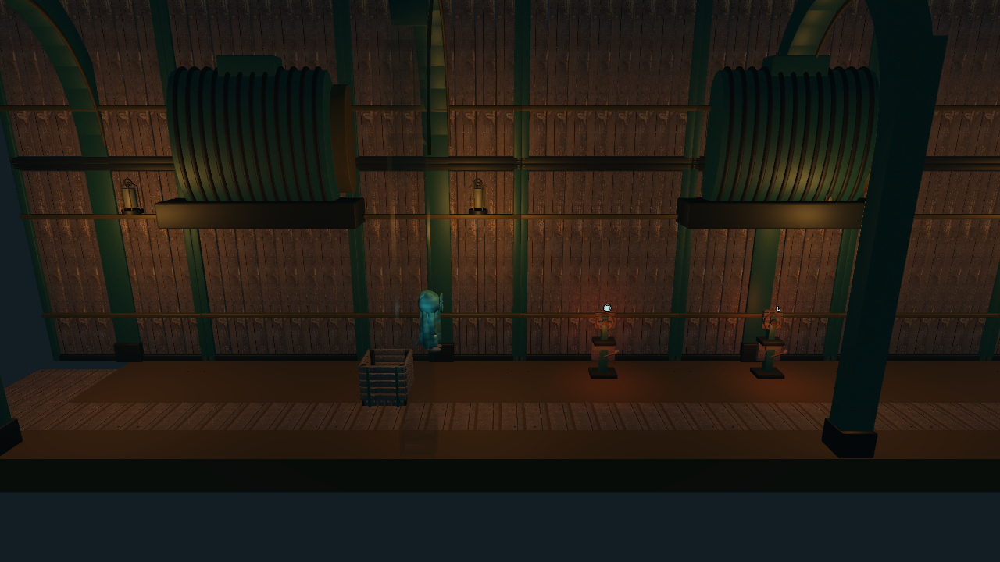
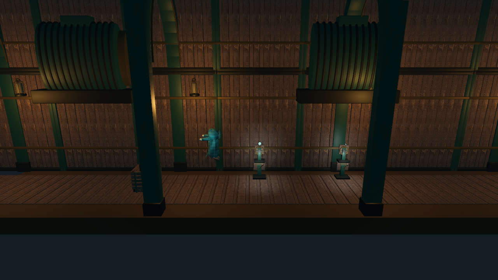
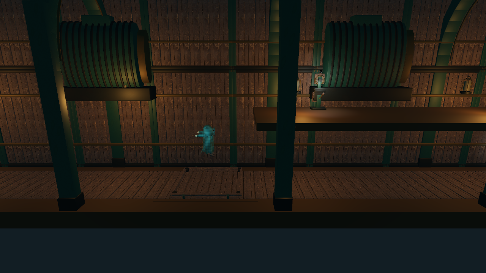

# 推箱阻挡与跳跃闪烁修复

2026-09-07；Windows、Godot 4.7.2、RTX 3070、Forward+。

## 原因与修改

- 第一关木箱向右运动的碰撞查询命中了 `Room1/fuse`，该物品当时不可见。运行时单独关闭保险丝碰撞后，同一段运动畅通；柱子结构碰撞不是这次阻挡的原因。
- 保险丝出生点由纵深 `z=0.5` 改为 `1.05`，避开箱子运输路线。同步修改可编辑房间场景与生成用内容数据。
- 拾取物提供 `set_concealed()`，统一控制可见性、交互组和物理碰撞。隐藏物品不执行重力；携带和插槽状态保持可见但无碰撞。
- 首次拉开箱子后，保险丝保持显露，不再因箱子回位而消失。房间快照保存 `fuse_revealed`；旧快照按原位置、箱子位置、移动及插槽状态恢复。旧出生点迁移到通路旁，其他移动后的坐标保留。
- 木板顶面和实心底板顶面都位于 `y=0`，镜头随跳跃升降时发生深度冲突。底板显示网格下移 `0.025 m`，碰撞体与木板高度不变。
- 额外确认 13 个升降台在底层停靠时也与木板共面：工坊 2、5；染洗间 2–5；悬线库 1–5；钟楼 2、4。升降台显示网格下移 `0.01 m`，同时避开木板与底板，承载和运动逻辑不变。

## 回归验证

- `tests/test_crate_surfaces.gd`：85 项检查，覆盖四个箱子房间双向通路、真实推箱越过柱子、隐藏物品不下落、反复显露与回位、携带／安装／放下、旧快照迁移及连续死亡重生，以及全部普通地板和升降台的显示面与碰撞面分离。
- `tests/test_full_routes.gd` 第一关路线增加显露前后的两次往返推拉；后续继续通过拾取保险丝、接电、开闩完成谜题。其余路线覆盖输送带、压机、浮台及全部 24 个房间。
- 完整 Windows 验证器 27 套、622 项检查全部通过，退出码为 0；新增专项同时纳入 `tools/verify.sh`。最终结果见 `artifacts/verification-results.json` 与 `artifacts/crate-full-verification-final.log`。
- Xbox 原始事件测试通过全部 24 个房间，并针对增强后的工坊往返路线再次验证。日志：`artifacts/crate-controller-console.log`、`artifacts/crate-controller-roundtrip.log`。本次没有实体手柄人工测试。
- 实际窗口使用正常人物物理和镜头，在四章地面及升降台共八处执行 24 次跳跃，包含八次奔跑跳跃及落地静止检查。184 项检查通过，保存 112 张截图；检查升起、最高点、下落和落地后的画面，原来的大块表面切换消失。24 个房间的水平表面边界检查没有剩余共面候选。
- 可复现窗口检查：`godot --path . --fixed-fps 60 --script tests/capture_jump_surfaces.gd`。日志：`artifacts/jump-surfaces-final.log`。边界检查仅用于定位候选，视觉结论结合窗口截图，不作为任意三角形相交的完整证明。

## 画面对照

地板修复前后（跳跃高度与取景略有差异）：

底层升降台在相同跳跃阶段的修复前后：

## Windows 交付

在 `artifacts/crate-fix-export` 独立副本执行资源导入和 `tools/export_windows.ps1`，避免重写工作区已有的素材导入设置。导出的 EXE 通过 PE、内嵌 PCK、ZIP 条目及哈希校验，并在无工程资源的独立目录启动 120 帧，退出码为 0。

交付位置：`build/MidnightWorkshop.exe`、`build/MidnightWorkshop-Windows.zip`。原有 `.import` 修改不纳入提交。窗口检查使用固定步长，不将该运行结果当作性能基准。
