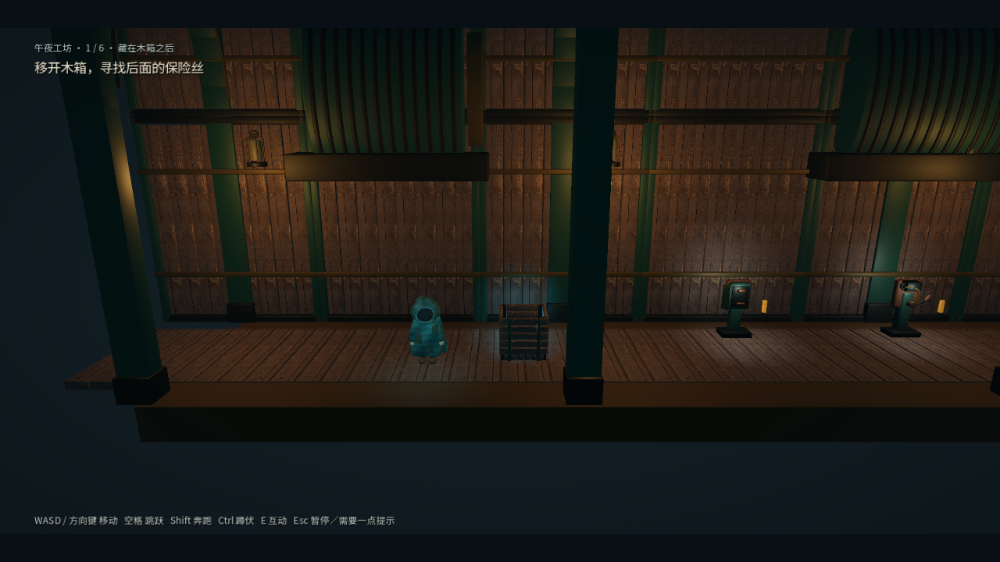
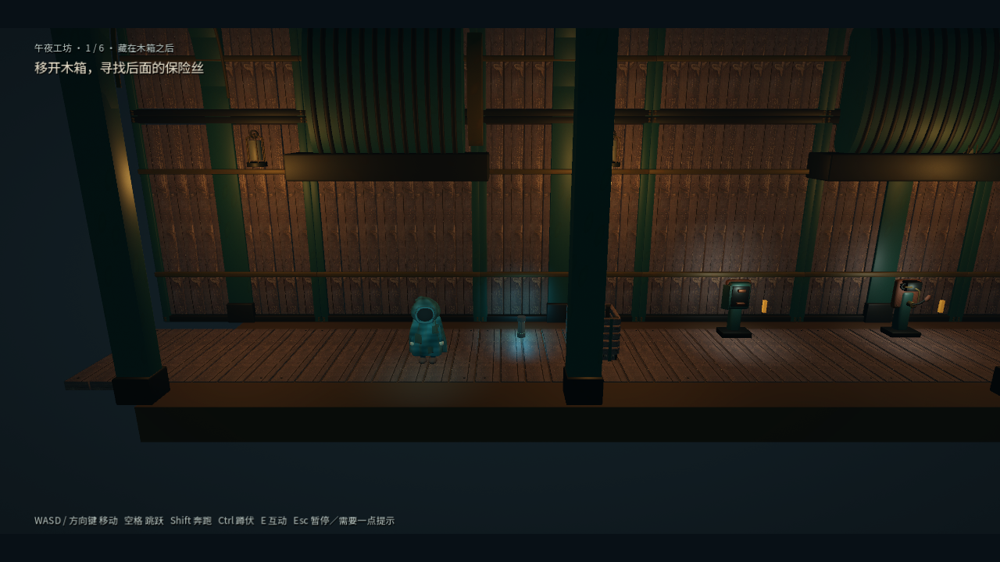
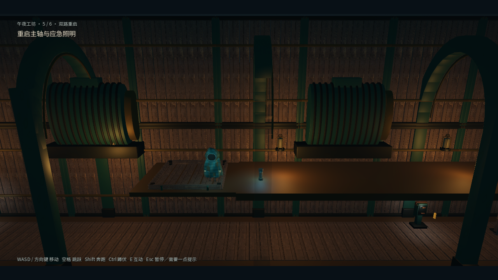

# 关键部件显隐与可读性修复

## 原因

第一关原逻辑将保险丝整个隐藏，并移除碰撞及交互组，仅在箱子移动到 `x < 5` 后显示。它与箱子实际遮挡没有关系，向右推开箱子仍然看不到。旧测试把这条规则当成了预期结果。

四章道具检查还发现：保险丝模型经过 0.55 倍缩放，只有约 0.11 米宽、0.275 米高；工坊第 5 房上层保险丝位于前景柱后，而柱子只根据玩家与柱子的横向距离淡出。其他 13 个散落部件没有同样的脚本隐藏，检查时落地位置正常，但暗色材质在正常镜头下不易辨认。

## 修复

- 第一关保险丝始终存在，放在箱子背面 `(7, 0.08, -0.95)`，避开推箱轨道。箱后蓝光提供线索；只向左或向右移动箱子一次即可自然露出。箱子、墙壁仍正常遮挡物体，拾取仍检查距离与实体遮挡。
- `fuse_revealed` 保留为提示进度，完全不控制模型或碰撞。移开箱子、携带或安装后记录发现；重复放回箱子不会再次代码隐藏。旧初始隐藏位置迁移到箱后，已发现并放下、携带或安装的状态保留。
- 共用 `item_presentation.gd` 将保险丝恢复到约 0.5 米高并同步碰撞尺寸，为 16 个部件提供保留原纹理的微弱材质亮部和局部拾取照明。每个物体只有一个拾取光源，携带或安装时关闭，重新取出后恢复。
- 前景柱同时考虑同房间、同楼层且横向 6 米内的散落部件；只有与镜头到部件的线段相交的前景装饰参与平滑淡出。保留结构碰撞，不使木箱或墙壁透明。
- 场景、生成数据及提示同步改为“移开箱子”，删除无用途的固定停靠坐标。通关路线改为一次向右推箱后拾取，避免反复推拉掩盖问题。

## 验证

专项测试覆盖初始实物、双向移箱和拾取、现有未发现存档迁移、掉落位置保留、携带/安装光源、上层前景遮挡、跨楼层限制，以及四章全部 16 个散落部件。既有箱子测试保留轨道、重复死亡及旧版携带/安装存档覆盖。

正常镜头截图由 `tests/capture_item_visibility.gd` 生成。窗口连续旅程使用 Xbox 原始输入事件，未连接实体手柄。完整 Windows 验证器、窗口通关及独立导出的记录分别位于 `artifacts/item-full-verification.log`、`artifacts/item-window-journey.log` 和 `artifacts/item-release.json`。

结果：33 套回归全部通过，退出码 0；道具可见性专项 47 项通过。窗口连续旅程 24/24 房间通过，退出码 0。Windows EXE 在仅含程序的目录启动通过，ZIP CRC 与包内外 EXE 哈希校验通过。

本次没有新增第三方素材，已有 GLB 和纹理保持不变；表现调整位于脚本中。Windows 导出在 `artifacts/item-export` 副本执行，保留原工程已有导入配置修改。

