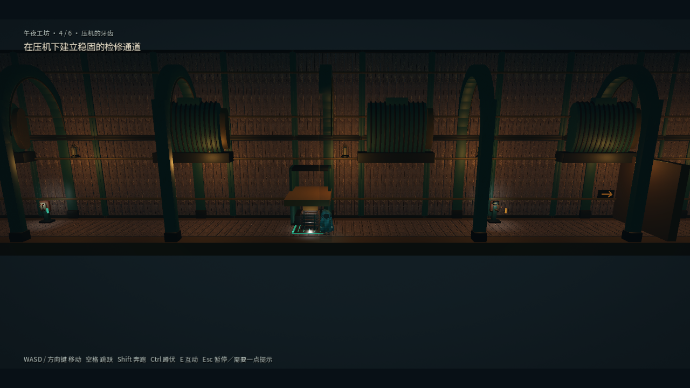
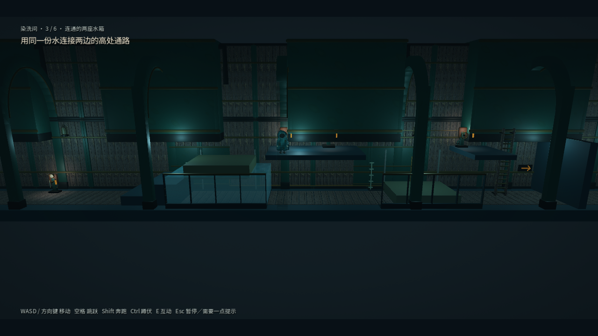
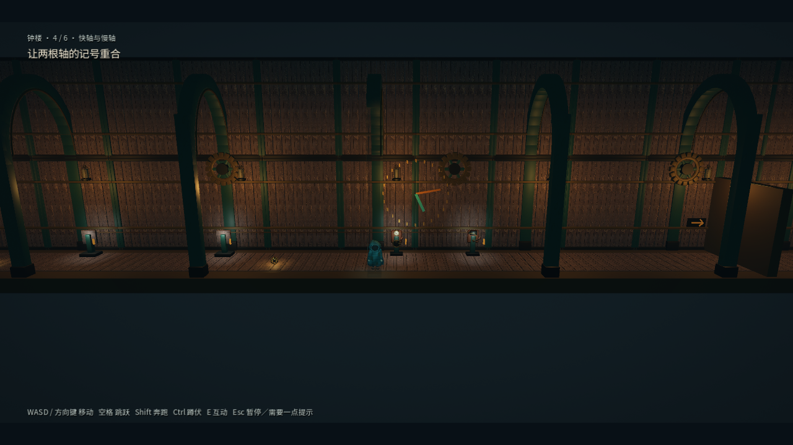

# 环境解谜升级 · 2026-09-08

保留四章、24 个房间、每章九个检查点 ID 与原创美术。把部分「切换档位即可开门」改成可观察的水量、承重、运动和时间关系。HUD 保留目标和完成后的出口方向；局部互动反馈解释装置状态，完整解法保留在主动查看的第三条提示中。

## 研究与素材

以下网页用于设计研究；本项目的应用是对机制的归纳和原创组合，不是 LIMBO 关卡复刻。

| 网页 / 资源 | 本项目采用的思路 |
|---|---|
| [Playdead 官方媒体资料](https://playdead.com/press/) | 轮廓、空间层次、互动对象的可读性；既有参考截图不作为游戏贴图 |
| [GDC：Limbo — Balancing Fun and Frustration](https://www.gdcvault.com/play/1013665/Limbo-Balancing-Fun-and-Frustration) | 根据公开介绍关注试错成本与挫折控制；未把付费完整演讲当作已阅读证据 |
| [LIMBO 关卡攻略](https://gamefaqs.gamespot.com/xbox360/991005-limbo/faqs/60492) | 从箱子、水面、机关复用等解法中归纳「展示规则—改变条件—组合规则」的结构 |
| [Chapter 22 图文攻略](https://www.supercheats.com/guides/limbo/chapter-twenty-two) | 多装置协同和时序参考；本版没有增加重力翻转 |
| [Poly Haven 木板](https://polyhaven.com/a/weathered_planks) / [CC0 许可](https://polyhaven.com/license) | 复用工程已有木材贴图 |
| [Kenney Impact Sounds](https://kenney.nl/assets/impact-sounds) | 复用工程已有 CC0 机械声 |
| [Kenney Factory Kit](https://kenney.nl/assets/factory-kit) | 可选资源调研，未导入 |

没有提取 LIMBO 模型、贴图、音乐或关卡数据。新增机械几何由代码生成；已有下载、哈希和许可证见 [素材台账](production/expansion-assets.md)。

## 24 个房间的结果

| 章 / 房间 | 规则与反馈 |
|---|---|
| 工坊 1 · 木箱之后 | 保留推拉发现保险丝，HUD 不提前列出解法 |
| 工坊 2 · 两条路 | 先供货篮，再经上层开回程梯，最后切换出口线路；货篮可呼叫 |
| 工坊 3 · 传送带 | 先推箱进入皮带，再送至实体挡扣；停电机后开启出口 |
| 工坊 4 · 压机 | 断电搬入支撑，复电后压头实际落在支撑高度，落稳才满足检修条件 |
| 工坊 5 · 双路重启 | 两枚保险丝供三处插座，运输完成后回收临时电源 |
| 工坊 6 · 最后一车 | 电机惊动追逐者，反转降低追逐速度，落闸结束威胁 |
| 染洗 1 · 淹没楼梯 | 截断进水、排水、等待真实水位低于安全线 |
| 染洗 2 · 浮箱 | 推箱对准开口、开盖、灌水、登箱上浮；可排水重新布置 |
| 染洗 3 · 双水箱 | 同一份水在两槽之间守恒转移，依次升起两块浮台；中央固定平台可存档 |
| 染洗 4 · 阀轮 | 用停靠等待、可呼叫的货篮把阀轮带回地面 |
| 染洗 5 · 水压 | 蓄水上楼排气，用上下联动杆切换供压；观察压力表和活塞后开门 |
| 染洗 6 · 蒸汽 | 三个错相喷口，共用可见预警与伤害状态；地面标出等待区 |
| 悬线 1 · 双砝码 | 一枚、两枚砝码对应不同平衡高度，刻度展示停靠位置 |
| 悬线 2 · 上下托盘 | 左台抬起后锁住，在固定中岛交接，同一砝码再抬右台 |
| 悬线 3 · 插销 | 实际桥面抬升、插销承重、取回砝码用于出口 |
| 悬线 4 · 深井 | 窄货笼运输砝码，玩家空手沿梯上楼，从货笼侧面取货 |
| 悬线 5 · 铃声 | 守卫沿后方声源移动，12 秒后返回；铃可重响，掩体提供等待位置 |
| 悬线 6 · 悬桥 | 三段独立抬起和固定，一枚砝码连续回收使用 |
| 钟楼 1 · 缺齿 | 装齿轮、反转、看齿条沿箭头退出锁孔 |
| 钟楼 2 · 离合 | 货台到顶后插销承重，切走动力仍保持停靠 |
| 钟楼 3 · 摆锤 | 等摆锤离开通道再冻结姿势；冻结在低处仍会危险 |
| 钟楼 4 · 双轴 | 快慢轴速度 2:1，制动只停快轴，指针重合才可接合 |
| 钟楼 5 · 钟面 | 选择第三刻度并等待真实指针对齐，制动后释放钟锤 |
| 钟楼 6 · 晨光 | 释放后重新运转，再运用安全相位和分段制动 |

水路使用确定性的有限体积模型；浮力通过角色碰撞体移动，支持玩家站立和起跳。配重、轴角、耦合、压头、齿条、浮台、活塞和制动计时均进入快照。钟面窗口约两秒；摆锤进入低处前预警至少一秒，蒸汽预警一秒，制动与铃声持续 12 秒。

可恢复性调整：不在浮台、货篮或淹没地面生成中点存档；货井保留前侧步行通道；双水槽在右侧出口阀打开前不解锁地面梯子；水压房增加上层联动杆，避免为切档再次穿过已灌满的水槽。

## 存档与工程

外层格式仍是 v2；新增内容版本 2。旧完整房间状态先备份原字节，再回退至同房间入口；保留章节及解锁进度。原文件损坏时使用有效备份；未来或无效内容版本不会被当成旧版本重写。测试均使用隔离路径。

`campaign_content.gd` 是关卡数据源，`tools/build_full_campaign.gd` 生成可编辑房间场景。逻辑组件位于 `scripts/puzzles/`；场景、测试与提示一起更新。没有变更角色输入、平台导出或现有纹理导入配置。

## 验证

- 连续物理输入路线：24/24；通过 `Input`、互动和碰撞行进，不靠瞬移、写完成标记或直接调用交互来解题。
- 窗口视觉夹具：`tests/capture_puzzle_upgrade.gd`，12 张截图在 `artifacts/puzzle-upgrade/`。这些夹具设置场景状态来检查渲染，不作为通关证据。
- 窗口完整旅程：`godot --path . --resolution 1280x720 --fixed-fps 60 --disable-vsync --log-file artifacts/upgrade-window-journey.log --script tests/test_journey.gd -- --capture`，修正后再次通过 24/24；包含真实菜单输入、暂停、检查点重试、重新加载后继续、四章切换和最终结局。日志没有 `ERROR` / `SCRIPT ERROR` / `FAIL`。
- 重建：在 `artifacts/builder-disposable-20260908-verify` 中执行 `python tests/test_builder.py`，连续生成两次及缺失场景失败保护均通过。修复了 Windows 默认 GBK 读取 UTF-8 资源的测试问题。
- 2026-09-09 完整 Windows 验证：`powershell -NoProfile -ExecutionPolicy Bypass -File tools/verify.ps1`，**39/39 套通过，退出码 0**；汇总 `artifacts/verification-results.json` 记录 1,369 条 `PASS:` 行。各套日志无引擎错误或失败行；部分测试退出时仍有基线中已有的 ObjectDB 警告。
- 编辑器资源扫描：`godot --headless --path . --editor --import --quit --log-file artifacts/upgrade-import.log`，退出码 0。

复审发现并修复了四项接触一致性问题：预警改为在可能接触玩家之前开始；碰撞使用站立或蹲伏高度；喷口和摆锤覆盖可用纵深；压机车架接触压头，浮箱仅被实际盖板限制。`test_contact_consistency.gd` 从六项失败变为八项通过，复审无剩余修改要求。

| 压头与支撑 | 守恒双水槽 | 快慢轴刻线 |
|---|---|---|
|  |  |  |

性能命令：`godot --path . --resolution 1280x720 --disable-vsync --log-file artifacts/upgrade-performance.log --script tests/benchmark_puzzle_upgrade.gd`。Windows、Godot 4.7.2、Vulkan Forward+、RTX 3070，其他验证进程结束后独立采样；每个局部场景预热 120 帧、采样 360 个渲染循环，统计 `process_frame` 间隔。原始数据在 `artifacts/puzzle-upgrade/performance.json`。

| 场景 | 平均循环帧率 | P95 间隔 | Draw calls |
|---|---:|---:|---:|
| 工坊 4 | 1093.6 | 1.312 ms | 160 |
| 染洗 3 | 978.0 | 1.498 ms | 189 |
| 悬线 2 | 899.7 | 1.770 ms | 223 |
| 钟楼 3 | 1074.4 | 1.296 ms | 176 |

这是关闭垂直同步后的局部场景循环测量，不是显示器实际刷新率、整章最差帧率或其他机器的性能承诺。完整物理路线的已知解法模拟时间分别约 249、211、288、201 秒；它们不代表初玩时长。

设计目标仍是每章首次游玩 15–20 分钟。自动路线是已知解法的输入检查，不是首次玩家用时或趣味性的真人盲测。未在本轮重新验证 macOS 或实体手柄。
