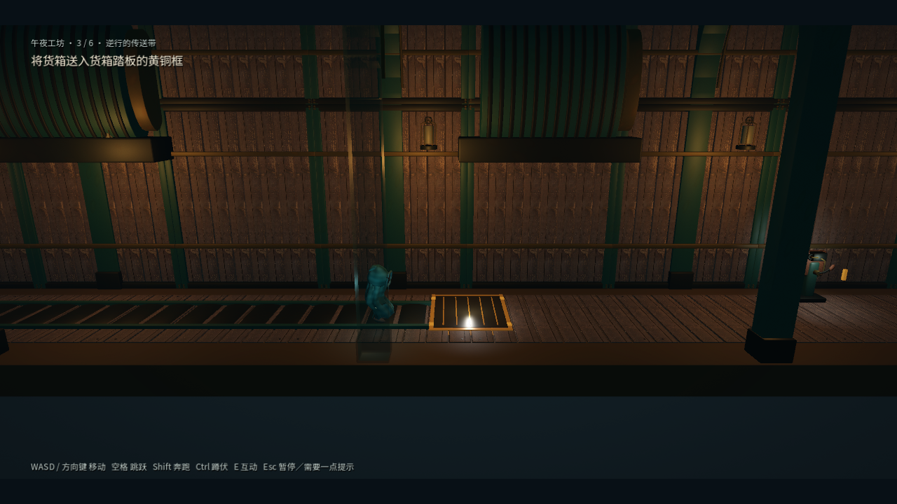
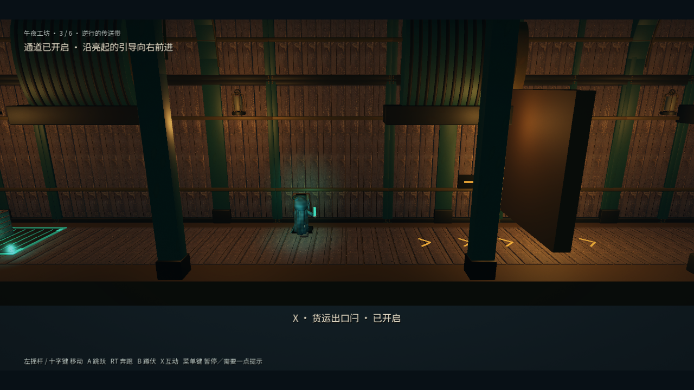

# 通关引导修复与连续旅程验证

环境：Windows、Godot 4.7.2、RTX 3070、Forward+。

## 原因与改动

原流程存在已知解法，但通关脚本直接知道机关坐标、箱子停靠位置及危险区相位，不能证明新玩家能找到路线。三个压力板标记位于显示表面以下，未满足条件的机关被交互系统过滤，已完成房间没有目标反馈；染洗间提示还将独立升降台描述为浮起的箱子。

- 工坊传送带、压机和染洗间供水踏板有可见黄铜框；压住后踏板下沉并变色，恢复快照后还原。表现层没有新增碰撞体。
- 所有房间的机关有中文名称，旋钮显示档位用途，制动杆显示实际剩余秒数。HUD 在离开制动杆后仍显示倒计时，过期后提示重新启动。
- 铃、保险丝箱、阀、制动杆和门闩使用已有对应模型。铃使用既有铃声音效；不引入新素材许可证。
- 可操作目标保持优先；没有可操作目标时，附近受锁机关仍可显示前置条件、部件类型或插槽占用原因。在受锁机关旁按互动键不会意外放下物品。
- 阶段目标由实际依赖关系派生，房间完成后显示向右前进，点亮出口箭头、地面引导和暖灯。暂停提示入口也显示在 HUD。
- 染洗间第 2 房改为先用箱子压供水踏板，再乘右侧升降台。同步修改可编辑场景与生成内容数据。
- 审查发现并修复了高处配重托盘的额外引导问题：空手时先取砝码，携带后才提示乘升降台，避免空跑上楼。

`device_labels.gd` 集中维护设备名称与档位词汇；可编辑机关规格可通过 `display_name`、`state_names` 覆盖。`get_blocked_reason(player)` 提供不可操作原因，`room_guidance.gd` 复用谜题依赖派生目标，`puzzle_presentation.gd` 只维护表现。无需迁移存档，剧情和碰撞规则保持兼容。

## 验证

- Windows 完整验证器全部 31 套通过，进程退出码 0：`artifacts/guidance-full-verification.log`。新增设备目录、表现、阶段目标和连续旅程测试，同时登记 Windows/macOS 验证器。
- 阶段目标测试最初复现九处反馈缺失；修复后追加高处托盘与 HUD 制动测试，最终 13 项通过。机关专项覆盖全部房间名称、错误/缺失/跨房间部件、插槽复用、依赖组合、倒计时和编辑器覆盖。
- 表现测试覆盖 24 个房间、三处压力板的显露/下压/恢复、对应模型和出口灯恢复。正常镜头截图确认标记可辨认，未通过提高全场亮度代替引导。
- `test_journey.gd` 从主菜单开始，通过实际移动和互动完成 24 个房间，途中用键盘菜单重试检查点，并重建管理器、从菜单继续存档，最后验证结尾及四章解锁。只注入独立测试存档路径，不直接设置通关标记或发射通关信号。
- 危险区通行改为观察红灯转青灯，不读取危险区内部相位。仍为已知路线测试，不代替陌生玩家可用性测试。
- 窗口内 Xbox 事件连续旅程：`godot --path . --fixed-fps 60 --script tests/test_journey.gd -- --controller --capture`。日志 `artifacts/guidance-window-journey.log`；截图 `artifacts/guidance-journey-*.png`。菜单测试使用键盘，场景操作注入 Xbox 原始事件，未连接实体手柄。

## 画面与交付

Windows 导出在独立副本 `artifacts/guidance-export` 完成资源导入和打包，既有 `.import` 修改未纳入提交。产物为 `build/MidnightWorkshop.exe` 和 `build/MidnightWorkshop-Windows.zip`；独立目录启动及包内外 EXE 哈希检查记录在 `artifacts/guidance-release.json`。
