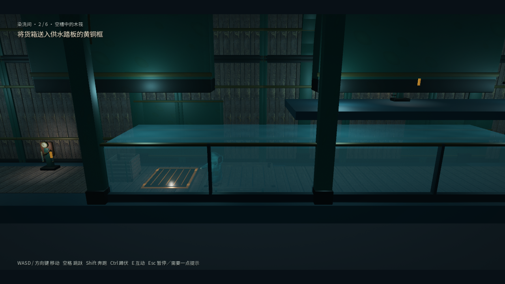
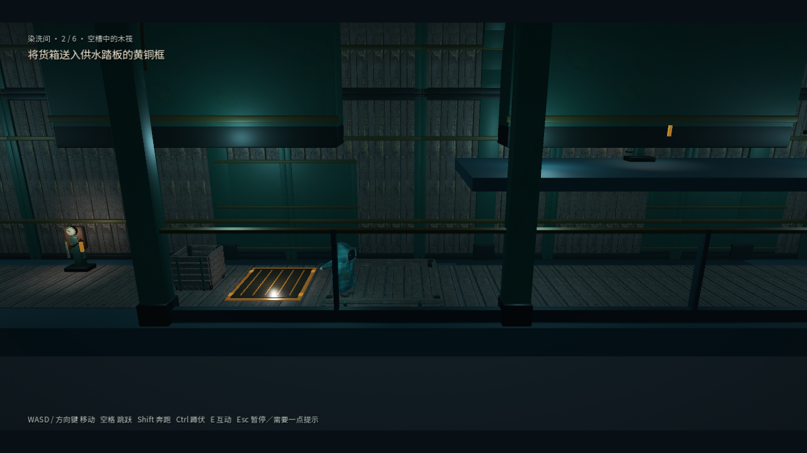

# 水体厚度与水槽边界修复

## 原因与实现

染洗间第 1、2、3、5 房共用的旧水体是厚度 0.08 的透明盒子。水位动画移动整个盒子，水面下方没有延伸到地面的侧面，也没有水槽边界。

现在使用可编辑的共用场景 `scenes/props/water_basin.tscn`：独立水面、四侧及底面构成水体；侧面从固定槽底伸到当前水面，深处颜色更深。水面只有轻微法线波纹，不改变顶点高度，避免边缘开缝。排空后隐藏水体与水面。

前后槽壁采用金属基座、观察玻璃、黄铜顶边与水位刻度；左右为开放的通行剖面。槽壁内侧距离中心线 2.08，位于玩家中心最大纵深 1.6 加半径 0.25 之外。地面碰撞、推箱轨道、升降台和梯子位置不变，没有新增游泳或浮力规则。

`set_water_level(level)` 同时更新水面与水体。存档继续使用 `water_y`，保留旧薄片中心的数值含义：可见水面为该值加 0.04。恢复存档立即重建水深，不等待动画追赶。新模型和着色器均为本项目原创，没有新增第三方素材。

## 验证方法

- `test_water_basin.gd` 在旧实现下复现四处失败，修复后覆盖四房间共 80 项：固定底面、连续顶面、升降过程、四种中间水位的快照恢复、排空隐藏及槽壁间距。
- `capture_water_basin.gd` 在 Forward+ 窗口中采集四房间低、中、高水位及侧面，共 16 张截图。画面检查确认水深可辨认，角色和压力板仍可见。
- 完整 Windows 验证器 32 套全部通过，进程退出码 0；连续旅程覆盖 24 房间、检查点重试、继续存档和最终结尾。窗口旅程 24/24 通过，退出码 0，使用注入的 Xbox 原始输入事件，未使用实体手柄。
- 资源导入与 Windows 导出在 `artifacts/water-export` 独立副本进行，避免改变原工程的已有导入配置。

日志：`artifacts/water-full-verification.log`、`artifacts/water-window.log`、`artifacts/water-window-journey.log`。交付包校验记录为 `artifacts/water-release.json`。

Windows EXE 在仅含程序文件的独立目录中窗口启动，退出码 0；ZIP CRC 检查通过，包内 EXE 与外部 EXE 的 SHA-256 一致。

